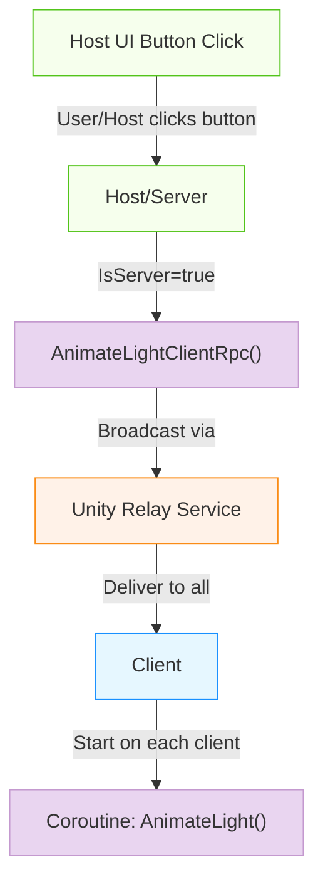

```mermaid
flowchart TD
    %% Main nodes
    Client["Client"]
    Relay["Unity Relay Service"]
    Host["Host/Server"]
    
    %% Light animation nodes
    HostUI["Host UI Button Click"]

    AnimateRPC["AnimateLightClientRpc()"]
    Animation["Coroutine: AnimateLight()"]
    

    
    %% Host flow
    HostUI -->|"User/Host clicks button"| Host
    Host -->|"IsServer=true"| AnimateRPC
    
    %% Common flow
    AnimateRPC -->|"Broadcast via"| Relay
    Relay -->|"Deliver to all"| Client

    Client -->|"Start on each client"| Animation
    
    %% Styling
    classDef client fill:#e6f7ff,stroke:#1890ff
    classDef host fill:#f6ffed,stroke:#52c41a
    classDef relay fill:#fff2e8,stroke:#fa8c16
    classDef action fill:#E9D5F0,stroke:#C499CF
    
    class Client,ClientUI client
    class Host,HostUI host
    class Relay relay
    class AnimateRPC,Animation action
```